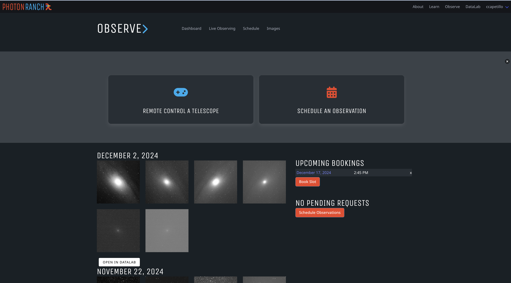

# lco-education-platform

This application is a part of the Photon Ranch Collection along with DataLab and the Education Platform. 
Observe@PTR is where users, typically students, will go to request observations on the 40cm network and perform live observing.  


## Project Setup Instructions

## Getting Started Locally
### STEP 1: Install Nix
If you don't have Nix installed, you can follow [these steps](https://github.com/LCOGT/public-wiki/wiki/Install-Nix)

### STEP 2: Enter the Nix Dev Environment
If you have [direnv](https://direnv.net/) installed, this should happen
automatically when you `cd` into the project directory.

Otherwise, you should:
```
nix develop --impure
```
### STEP 3: Apply Configurations
```
ctlptl apply -f local-registry.yaml -f local-cluster.yaml
```

### STEP 4: Start the Skaffold Dev Loop

```
skaffold -m app dev --port-forward
```
After this step, you should be able to navigate to `http://127.0.0.1:8080` and run the application locally.

